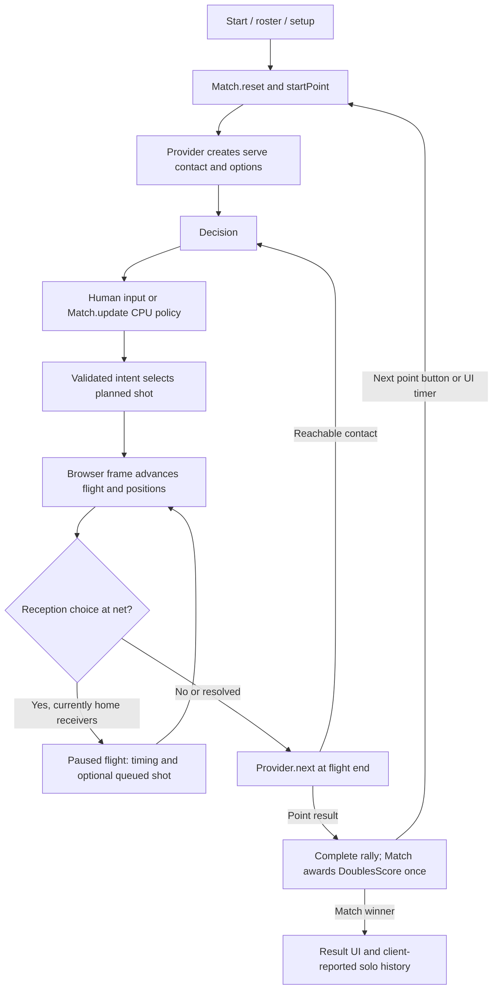
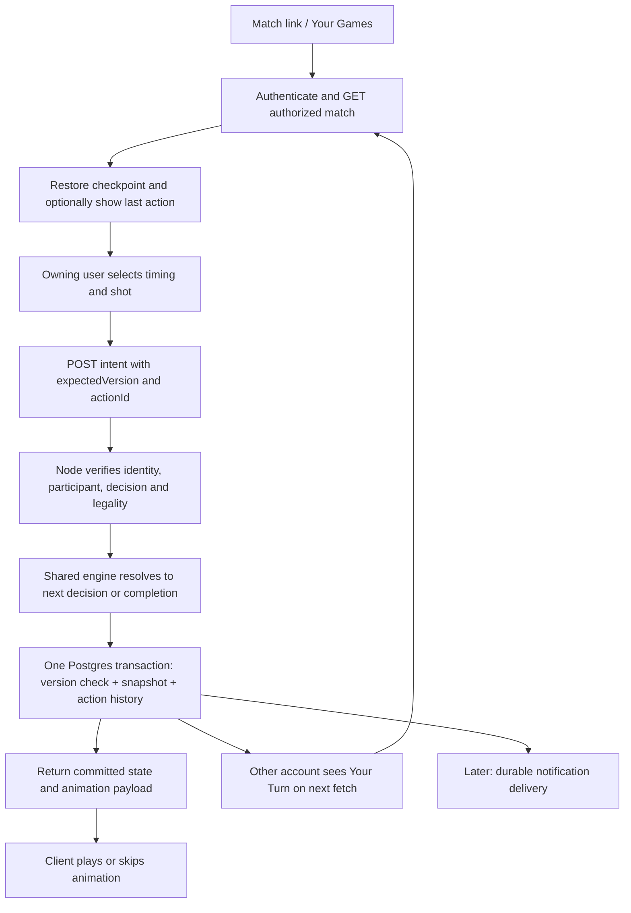

# PickleBash: Turn-Based Multiplayer Plan

Status: Phases 1–3 implemented and deployed; the user confirmed successful two-device remote play. The user also confirmed match creation and joining friends' matches. Multiplayer home exists and needs substantial design updates. The active product direction is social-first; see [the current backlog](docs/BACKLOG.md). Phase descriptions below remain acceptance references, not an assertion that every listed feature is still unbuilt.

**Outcome:** two friends can invite, play a complete asynchronous match, leave between turns, resume on another device, finish, see their series update, and start a rematch. Preserve the existing court, athletes, shot mechanics, scoring, and solo game.

**Recommendation:** adapt the existing TypeScript engine; retain Supabase Auth/Postgres and the Railway Node service. Persist authoritative decision checkpoints, resolve actions on the server, and send resolved animation data to the browser. Keep a latest snapshot plus append-only accepted-action history. No full event sourcing.

The proposed V1 is two human accounts, each controlling both athletes on one doubles team. This control model is approved; four-human play and CPU partners in multiplayer V1 are out of scope. A turn normally means one shot, including its reception timing choice. Within rallies teams alternate; across point boundaries the next server may belong to the person who just acted. Never implement turn ownership as an unconditional A/B toggle.

## 1. Current Architecture

### Repository findings

The executable source is more current than parts of README.md, docs/MATCH.md, and docs/RAILWAY.md. Older documentation refers to removed guided/lab modules, no accounts, and manual partner defaults. The findings below follow current source. Repository configuration and migrations were inspected; production service settings and applied database migrations were not independently verified.

| Area | What exists and where | Implication |
| --- | --- | --- |
| Frontend | Vite 7, TypeScript 5.9, vanilla DOM/CSS; no React/Vue or routing dependency. `src/main.ts` is the composition root and contains much UI orchestration. | Add small screen/controller modules; no frontend framework migration. |
| 3D | Three.js 0.180; `src/scene.ts` owns `CourtScene`, renderer, perspective camera, OrbitControls, court/athlete objects, labels, guides and effects. `athlete*.ts`, `pickleball.ts`, `trees.ts` support rendering. `render` receives GameState and RallyShot. | Preserve scene assets and APIs behind a presentation adapter. The renderer already largely consumes state. |
| Application loop | `main.ts` constructs one `Match`, enables partner autonomy and randomized reset seeds, and calls `match.update(dt)` from requestAnimationFrame. UI controls affect speed, pauses and point-result timers. | Browser time currently drives logical progression; remote mode must not use this loop to award points or advance authority. |
| Match | `src/match.ts` composes RallyEngine, DoublesScore, shot planning, receiver selection, context, seed, roster, CPU policy/memory, practice, commands and replay. | Extract bounded seams; do not replace the simulation. |
| Rally state | `engine/model.ts`: GameState schemaVersion 2, phase decision/flight/complete, tactical stage, shot/leg indices, elapsed/simulation time, ball, four players, histories, bounces, score, current hitter, possession and result. | This is a serializable display/simulation snapshot, not a complete saved match. |
| Hidden rally state | `engine/rally-engine.ts`: private options, activeShot, movementStart, shotElapsed, receptionPrompt, plus a provider with setup/next callbacks. | JSON.stringify(match.snapshot()) cannot restore execution. No import/hydration boundary exists. |
| Hidden match state | Scoring instance, `awarded`, point number, seed, roster overrides, currentContext/customIndex, reception queues, CPU memory/strategy/choice history live outside GameState. | Explicitly model or deliberately exclude each item; never serialize the class instance wholesale. |
| Scoring | `engine/scoring.ts`: DoublesScore tracks score, serving team, server, serverNumber, each team's right-court athlete and winner. Starts 0–0–2; side-out, to 11, win by two. Match.update awards a terminal rally once using `awarded`. | Persist all serve rotation data. RallyEngine's demonstration score increment is subsequently overwritten by Match's scoring; establish DoublesScore as the sole match score authority. |
| Participants | Court slots are `you`, `partner`, `opponent-left`, `opponent-right`, on home/away teams. PlayerState includes position, facing, handedness, eleven skills and tendencies. DesignedPlayer has separate saved identity, name and appearance. | Court slots, saved athletes and human account IDs are three different identities. Never replace a court slot with a user UUID. |
| Choices | ShotIntent schemaVersion 1; contextual menus, point/zone/player targets, serve styles and reception choices. `shot-intent.ts`, `decision-menu.ts`, `shot-families.ts`, `targeting.ts`, `execution.ts`, `trajectory.ts` provide validation/planning. | Reuse intent and contextual legality; server must regenerate plans rather than accept client flight legs or outcomes. |
| Human input | Buttons, Space, target-picker court taps, custom text/voice and optional browser tool integration reach Match submission methods. Several gates explicitly require `possession==='home'`; currentContext is populated for home contacts. | Every input adapter needs the same ownership gate and remote submission boundary. |
| CPU | Match.update triggers away decisions automatically; partner autonomy defaults on in main.ts, optional player autoplay exists. `localDecision` uses seeded variation/history. Browser default brain mode is LLM; headless default is local. Background strategy comes through `/api/opponent`; `/api/command` interprets custom shots. | Explicit controller configuration replaces side-specific automation. No LLM requests in authoritative multiplayer resolution. |
| Reception | Incoming away shots can carry airborne/bounced branches. RallyEngine pauses a flight at the net to ask the receiving home team. UI can queue timing plus intent, or choose timing first. | A paused reception is a real decision, despite `phase==='flight'`. Generalize for either receiving team; ownership cannot come from currentHitter/possession alone. |
| Persistence | `player-design.ts`, `cloud-players.ts`: local roster plus Supabase cloud saves; local controls; `account-panel.ts`: account-scoped pending completed-result queue and in-memory dedupe. Replay frames/practice records are session data. | No persisted live match. Keep existing solo persistence separate. |
| Auth/profiles | CloudPlayerSync uses Supabase anonymous sign-in, persisted sessions, email upgrade, existing-account email links and account-change reloads. Migrations define auth-backed profiles with optional display_name. Saved athletes belong to owners. | Reuse account identity; add lightweight human display identity, not another auth system. Guest identity alone cannot recover itself on a different device. |
| Database | Four migrations define profiles, players, player_progress, match_history and account_progress; RLS mostly permits owner access. `record_match*` RPCs accept client-reported solo scores and validate shape/scoring limits. | These RPCs do not prove a game was played. They cannot establish multiplayer results or human rivalry. |
| Deployment | `railway.json` builds Vite and starts `server/production.mjs`: static dist, `/healthz`, `/api/*` passed to the opponent handler. Development proxy covers only opponent/command. | Extend existing Node routing and build server engine output; no second deployment required. |
| Navigation | main.ts switches start/setup/court through DOM state and dialogs; `?design=1` opens design. Production serves actual paths and otherwise 404s; no SPA fallback. Auth returnUrl retains pathname but drops query/hash. | Add real match/invite URLs, a narrow SPA fallback and safe post-auth return handling. |

### Current state flow



### Randomness and determinism

- Match seed defaults to 1741; UI enables crypto-generated seeds on reset. Shot execution uses `(seed + point*104729 + index*7919) >>> 0`. `execution.ts` derives seeded mishits, target/lift error and duration variance. Body-serve hits/dodges and reception misses have seeded functions. Local policy also uses seed plus recent choices.
- `random-lineup.ts`, match setup shuffling and appearance randomization use Math.random. Generated roster/skills must be frozen before multiplayer starts. UUID generation is identity randomness, not shot randomness. Tree effects use wall-clock time and remain visual.
- Same seed, roster, decisions, policy history and local engine version have repeatability tests. This is **not** evidence that arbitrary frame schedules, asynchronous LLM strategy arrival, and fresh clients always produce identical matches. Browser/headless defaults also differ.
- Menus currently contain already planned/sample-resolved shots, and custom target previews use the same planning machinery. A remote client must not receive secret seeds or outcomes for unchosen options, or execute a local preview to discover guaranteed misses.
- Use server authority **and** deterministic seeded resolution. Derive a private decision seed from a server-held per-match secret, engine version, point and shot index; do not include a client-chosen request ID or retry count. Preserve current execution mathematics after supplying the derived seed. Repeated validation/preview must not consume randomness. Store committed outcomes and seed-derivation version for diagnosis; private seed material is never in match GET responses.

Existing Node tests and the headless evaluator (`src/game-evaluation.ts`) demonstrate that much simulation already runs without Three.js. Extract browser/network orchestration from the shared resolver, rather than creating a second gameplay implementation.

Assessment validation: all 34 tests passed across `tests/game-state.test.ts`, `tests/match.test.ts`, `tests/reception-timing.test.ts`, `tests/cloud-players.test.ts` and `tests/player-history.test.ts`. This was a representative baseline, not the full suite, production verification or a multiplayer test. At the assessment step, only this planning document was added. Phase 1 implementation and final validation are now documented in [docs/PHASE-1-CHECKPOINTS.md](docs/PHASE-1-CHECKPOINTS.md).

## 2. Multiplayer Architecture

### Boundaries to introduce

1. **Shared logical engine:** explicit checkpoint codec and `resolveTurn(checkpoint, action, serverContext)`. Reuse scoring, intent validation, trajectory/reception math and positioning. No DOM, fetch, requestAnimationFrame, live account access, replay frame capture or wall-clock reads.
2. **Controllers:** a slot/team-to-controller mapping for solo CPU or human input. Solo remains available through the existing Match-facing adapter. Multiplayer V1 uses two human team controllers; neither team's shots auto-submit.
3. **Server application service:** authenticate, load authorized match, regenerate legal choices, resolve, and atomically commit through Postgres. AI text interpretation may propose an intent later but cannot authorize it.
4. **Browser match session:** authoritative state cache, pending request identity, loading/error state, and read-only presentation playback. All menu, keyboard, target and later voice entry points call this session API.
5. **Scene adapter:** reconstruct court and athletes from checkpoints; interpolate committed trajectories for optional playback. Skipping animation, backgrounding or closing the browser changes no score or turn.

Proposed modules are small files under `src/engine/`, `src/multiplayer/`, and `server/multiplayer/`; these directories need not become a package framework.



### Canonical checkpoints instead of persisted playback clocks

Persist at `contact`, `reception`, or `completed` logical boundaries. During a reception checkpoint, preserve the incoming shot's remaining legal branch geometry, each candidate receiver/contact context, boundary positions and ball velocity. This geometry determines what can happen next and is logical data even though the renderer also uses it.

Resolve a selected shot immediately through flight endpoints to the next decision, independent of display frames. At a reception checkpoint, submit timing and a shot together; the resolver applies the chosen incoming branch, validates the resulting contact/actor, and resolves the outgoing shot. A timing selection alone is a local preview/draft, not a second network turn.

For initial development an internal advance-to-boundary helper may drive RallyEngine, with progress guards and explicit detection of the reception pause. Its acceptance gate is equivalence across frame partitions. Extract direct boundary advancement where needed; do not promote an unproven `while(update(.1))` loop to the authoritative protocol. An iteration limit aborts without a write; it never awards a fabricated winner.

When a shot ends a rally, apply DoublesScore once and prepare the next server's contact in the same logical transition, unless the match ended. Include the point result in the response for the existing result banner. The banner's timer is presentation only. No network “Next point” action, no duplicate score, and no browser needed to finish the transition.

## 3. State Model

### Match and decision contract

Illustrative TypeScript contract for implementation; referenced geometry types reuse existing engine models. Runtime validation must reject unknown versions, invalid discriminated unions, nonfinite numbers and inconsistent identities.

```ts
type MatchStatus = 'invited' | 'active' | 'completed' | 'rematch_pending';

type Decision =
  | { kind: 'contact'; id: string; team: Team; actor: PlayerId;
      context: ShotContext; designatedServeReceiver: PlayerId | null }
  | { kind: 'reception'; id: string; team: Team;
      incoming: PendingIncomingShot;
      branches: Partial<Record<'air' | 'bounce', {
        actor: PlayerId; context: ShotContext;
        legs: FlightLeg[]; positions: Record<PlayerId, Vec3>;
        resolution: ShotResolution;
      }>> }
  | { kind: 'completed' };

interface LogicalMatchStateV1 {
  schemaVersion: 1;             // distinct from legacy GameState schemaVersion 2
  engineVersion: string;       // immutable rules/resolver release identifier
  rules: { scoring: 'side-out-doubles'; target: number; winBy: number };
  controllers: Record<Team, { kind: 'human'; userId: string }>;
  roster: Record<PlayerId, FrozenAthlete>; // name, appearance, skills, tendencies,
                                           // handedness, optional owner+athlete ID
  scoring: {
    score: Record<Team, number>; serving: Team; server: PlayerId;
    serverNumber: 1 | 2; right: Record<Team, PlayerId>; winner: Team | null;
  };
  pointIndex: number;
  rally: {
    shotIndex: number; stage: RallyStage; bounces: number;
    ball: BallState; players: PlayerState[];
    shotHistory: ShotIntent[]; // current rally only; preserve existing consumers
  };
  decision: Decision;
  lastPointResult: { pointIndex: number; result: PointResult } | null;
}
```

`PendingIncomingShot` is an explicit serializable subset of RallyShot: intent, actor, contact, legs, branch start/movement origin and progress needed to reconstruct the canonical net boundary. It contains no functions or UI nodes. During Phase 1, enumerate fields against the existing `chooseReception`/movement implementation and test both branch continuations; do not infer this solely from the public GameState.

The **database match envelope** stores ID, status, home/away user IDs (away nullable while invited), current action user ID, version bigint, schema/engine versions, state JSONB (null before activation), created/updated/started/completed timestamps, winner user/team, rematch parent ID and invitation metadata. It additionally holds a private resolution secret and seed version. A safe response DTO omits secret material and unselected shot outcomes. Timestamp fields use server/database time.

`current_action_user_id` is an indexed projection of decision.team → controllers, verified on every commit. It is null for invited, rematch_pending and completed rows. With reception branches, the team is known even if the final athlete depends on timing. Available action descriptors are regenerated from decision context and engineVersion, labelled with decision ID/version; they are not a second mutable source of truth.

### Invariants

- Four court slots, two distinct human accounts, one fixed team per account. The same saved athlete ID under different owners is not the same identity.
- Scores and serving formation come from DoublesScore; no independent client score field. Awarding a rally and starting its successor is one transition.
- Roster, skills, handedness, rules and control policy freeze at activation. Mid-match design edits, substitutions, restart, practice and autoplay settings cannot change a remote match.
- Every active checkpoint names a legal decision owned by one participant; completed matches have a winner and completion timestamp and accept no gameplay action.
- Version increments once per accepted lifecycle mutation or turn. Decision IDs are scoped to that version; retries preserve the action ID. JSON codec does not reseed or run constructor reset side effects.
- Current-rally history is logical input only as required by reused code. Full rally event/animation history moves to accepted-action records; do not copy full-match frame arrays into every snapshot.

### Presentation and local saves

Do not persist camera, orbit damping, effects/trails, selection hover, dialogue state, voice capture, pending parser requests, replay cursor, playback speed or animation elapsed time as match authority. Save user preferences separately as today.

Phase 1 local saves use the same checkpoint representation plus a local-only configuration/CPU-state extension for solo: seed, controller flags, frozen roster, partner instructions, policy memory/recent choices and accepted strategy when relevant. Offline saves are scoped by account and mode. Saving after each accepted local action is required; unload handlers are insufficient. A refresh during animation resumes the already committed next decision, optionally replaying that action from the start, with exactly the same logical outcome. This deliberately does not promise restoration of a specific video frame.

Pending LLM requests are canceled/discarded on restore, never serialized. Baseline round-trip guarantees use local CPU mode; preserving solo LLM behavior requires recording a chosen strategy/input before it affects resolution, not waiting on the same external response twice.

## 4. Backend Recommendation

**Retain Supabase Auth/Postgres and extend the existing Railway Node server.** Auth and relational persistence are already dependencies with migrations, account UI and tests. Node can reuse the TypeScript game math already exercised by tests/evaluation. A small API plus transactional database function fits this codebase better than another hosted backend or rewriting game logic in SQL.

| Option | Assessment for this repository |
| --- | --- |
| Existing Supabase + Node | Recommended: reuse identity, migrations and deployment; add a small authoritative service. |
| Supabase Edge Functions | Possible later, but introduces another runtime/deployment path without a current need. |
| Firebase | Would add another identity/database model and migration work; no repository advantage identified. |
| Separate custom auth/database stack | Duplicates working infrastructure and operational work. |

Compile shared engine and server TypeScript to a separate server output directory in the production build; current `tsconfig.json` only typechecks src and Vite builds the browser. Add a Node-compatible module-resolution/build configuration and test the emitted production server, not only tsx. Preserve static asset hosting, health checks and existing AI routes. Development proxy must include the new match endpoints.

Use Supabase server-side token verification (for example `auth.getUser(token)`), not a trusted browser session object. Keep privileged database credentials server-only, out of all `VITE_*` variables. Multiplayer tables should deny direct client writes. Start with API-only multiplayer reads too, returning participant-authorized DTOs; existing owner-scoped roster access remains unchanged. Service-role access bypasses RLS, so API authorization and commit-function checks remain essential. [Supabase RLS documentation](https://supabase.com/docs/guides/database/postgres/row-level-security)

For each commit, Node resolves outside the transaction from version N. A narrowly granted Postgres RPC locks the match row, checks actor membership/status/current owner/expected version, and writes snapshot, action receipt and required lifecycle effects atomically. Revoke function execution from PUBLIC, anon and authenticated; only the trusted server can supply resolved state. Fully qualify SQL names and constrain search_path for any SECURITY DEFINER function. Database code protects atomicity; the server protects gameplay validity. [Supabase API security guidance](https://supabase.com/docs/guides/api/securing-your-api)

Anonymous accounts already have unique auth identities, but a lost guest session is not a cross-device login method. Reuse email upgrade/login for recovery and test conversion without changing the account ID. Never allow an invite link to impersonate an existing participant. [Supabase anonymous sign-ins](https://supabase.com/docs/guides/auth/auth-anonymous)

No WebSockets, Redis, queue platform or microservices are needed for the first remote slice. Use bounded polling while the relevant screen is visible, plus fetch on focus/online/navigation. Notification delivery is added after the full play/rematch loop works.

## 5. Data Model

Proposed new names use `async_` where helpful to prevent confusion with client-reported solo history.

| Entity | Initial design | Persistence decision |
| --- | --- | --- |
| Users | Reuse `auth.users`; extend `profiles` with an optional small avatar preset, using existing display_name. Expose only public identity fields to match participants. | Existing; no new users table, no public email exposure. |
| Saved athletes | Reuse `players`; copy validated athlete fields into the match roster at activation. | Existing + frozen snapshot; later deletion/edit does not change a match. |
| Matches | `async_matches`: envelope from §3, home_user_id, nullable away_user_id, state JSONB, private seed data. Creator roster proposal frozen on creation; receiver selection freezes on acceptance. | New, Phase 3; one current authoritative snapshot per match. |
| Match players | Two participant columns and fixed team controllers suffice for exactly two accounts. Four athletes live in roster JSON. | No match_players table for V1. Add only if supporting four humans or richer per-participant state. |
| Invites | On the pending match: token hash, expires_at, accepted_at, proposed roster/rules. High-entropy raw token exists only in generated link/creation receipt; exclude from general reads/logs. | Add Phase 4; no separate challenge table initially. |
| Action/turn history | `async_match_actions`: match_id, action_id, authenticated actor, request hash, kind, expected/from/to versions, canonical intent/timing, engineVersion, committed result/animation and resulting checkpoint receipt, created_at. | New in Phase 3, append-only via commit RPC. Unique (match_id, action_id) and (match_id, to_version). Also records invite/rematch lifecycle mutations; no frame snapshots. |
| Friendships | Sharing a link establishes match participation, not mutual address-book friendship. Derive recent opponents from shared matches. | Deferred; no friendships table. |
| Head-to-head | Canonical sorted pair of account UUIDs. Count completed authoritative matches; wins per account, total, current winning streak and series lead. Order completions by completed_at then match ID. | Derived in Phase 6; no stats cache table yet. |
| Notifications | Your Turn derives from match state. Later `notification_outbox` stores recipient, match/version, event kind, delivery state/attempts and unique dedupe key. Read/seen marker only if needed for inbox badges. | No notification table required for Phase 3/5; add durable outbox in Phase 7. |
| Analytics | Accepted actions/lifecycle rows supply trusted events. Small idempotent product-event capture for share attempts only. | Reuse history; no warehouse/platform or materialized pair counters initially. |
| Solo history/progress | Keep `match_history`, `record_match*`, player_progress and account_progress behavior isolated. | Existing. Never import solo results into human pair stats or call solo result reporting from remote completion. |

Indexes: (home_user_id, updated_at, id), (away_user_id, updated_at, id), (current_action_user_id, updated_at, id) for active lists; normalized pair + completed_at/id for rivalry; token hash uniqueness; rematch_parent_id uniqueness for one successor per completed match. Lifecycle idempotency for initial creation needs a unique (creator, creation_request_id) as there is no match ID yet. Use cursor pagination; list summaries exclude state/history payloads.

Choose **B: latest state + append-only history**. Snapshots are the resume source; history is for retry receipts, debugging and later replay/statistics. Retain one compact resulting checkpoint per accepted action initially to return an exact receipt after later actions; it is not a requirement to reconstruct the match by replaying all events. Store trajectories once per action, not at 30fps. Measure payload growth before adding compression, pruning or checkpoints-on-a-schedule. Full event sourcing, undo controls, admin recovery UI, recaps and replay browsing are deferred.

History storage remains server-only. Receipt responses use the same redacted public state DTO as match GET; neither historical checkpoints nor animation payloads may disclose private seed material or unchosen outgoing-shot outcomes.

## 6. Turn Lifecycle

### Request and response

```json
{
  "actionId": "client-generated-uuid-retained-until-resolved",
  "expectedVersion": 17,
  "decisionId": "match-scoped-decision-id",
  "action": {
    "kind": "play_shot",
    "timing": "air",
    "intent": { "schemaVersion": 1, "actor": "opponent-left", "...": "canonical ShotIntent fields" }
  }
}
```

Illustrative request, not a complete valid ShotIntent. Timing is required at reception and absent at a plain contact. Do not accept score, winner, roster changes, trajectory, seed or next-owner fields from the client.

1. Open `/matches/:id`; restore authentication, GET participant-authorized state, receipt summary and legal descriptors. Display Your Turn, Waiting or Completed from server data.
2. Map the viewer to a fixed engine team. Keep world coordinates and court slot IDs stable. For the away viewer, rotate the camera/labels and convert targeting coordinates at the UI boundary; never swap authoritative IDs. Preserve handedness semantics.
3. Select timing/shot/target. Preview intended aim only, not sampled execution results. Persist the pending request before transmission; disable repeat input during submission.
4. POST `/api/matches/:id/actions` with bearer token. Server validates request size/schema, token, participant and action ID. It checks for an existing receipt **before** rejecting an old expected version.
5. Same action ID + same normalized payload and same actor returns the original receipt. Same ID with different content returns conflict. This covers retries after a committed response was lost.
6. Load version N. Check active status, ownership and decision ID. Regenerate legal timing/actor/intent from the frozen state. Validate enum/range, target geometry, shot contact gates and serve restrictions; menu membership alone is insufficient for custom point targets.
7. Resolve using the pinned engine version/private seed. Stop at the next human decision or match completion. No external calls or presentation timers. Validate the resulting invariants.
8. Commit through the RPC. Lock/recheck version and participant, insert the unique receipt, replace state/summary columns, advance version, and set terminal result/timestamps if appropriate. Any failure rolls everything back. No notification or success analytics before commit.
9. Return `{actionId, fromVersion, toVersion, state, result, animation}`. Client replaces its logical state and optionally animates the committed shot. Animation never submits another action or awards points.
10. Other participant sees the new state on their next fetch. A new turn may belong to the same user after point-end service rotation; notify only the actual action owner.

### Failure and security behavior required in Phase 3

| Situation | Required behavior |
| --- | --- |
| Two devices submit at version N | Exactly one commit. Other request receives 409 and current-version guidance; never silently reapply it to a different decision. |
| Timeout or browser closes after POST | Retain action ID and retry/query receipt. Do not generate a fresh ID for the same attempt. GET current match after recovery. |
| Old receipt arrives after newer state | Acknowledge receipt, but never replace state with a lower version; fetch current state if needed. |
| Wrong participant / spoofed actor | Reject. Account comes from token; actor must belong to that account's team and selected contact branch. |
| Opponent edits / score forgery | No client table writes or state-shaped endpoint; server plans all results. Existing solo RPCs confer no multiplayer authority. |
| Offline | Show cached match with offline status; keep draft locally. Do not claim a turn was accepted or queue an automatic new turn without revalidation. |
| Expired authentication | Preserve pending request/destination, reauthenticate same account, then retrieve receipt/current state. A different account cannot resume that request. |
| Server crashes | Before commit: no state change. After commit: durable receipt answers retry. Process memory is never match storage. |
| Unsupported schema/engine | Return an explicit update/compatibility error without modifying the match. Keep old engine resolvers until their active games complete or an explicit migration is tested. |
| Cost/abuse | Validate body limits and resolution work; rate-limit create/join/submit. Never invoke the existing AI routes as a mandatory turn step. |

### Invite and rematch lifecycle

`invited → active → completed`; the completed parent never changes back to active. Rematch creates a **new child match** in `rematch_pending`, pointing to that completed parent; friend acceptance transitions the child to active. Thus completion timestamps and rivalry history remain stable.

Invite creation uses a random, expiring, single-use bearer token. GET of a link provides only a minimal preview; activation requires an authenticated POST acceptance. Atomically bind the open away seat to that account and initialize the checkpoint. Reject self-join, occupied seats and expired tokens; a retry by the same successful joiner returns their match. Possessing the link never grants membership to a third account after acceptance.

Rematch is one tap for the requester; the friend accepts with one tap. Simultaneous requests converge on the same child: if the other participant requests an existing pending child, treat that as acceptance. Uniqueness plus a row lock prevents two children. Alternate opening serve from the parent, keep side assignments and frozen roster by default, and allow roster changes only before a new match activates. Expired invitations remain non-active with derived “Expired” UI; no extra status is needed until cancellation/decline becomes a product requirement.

## 7. Phased Build Plan

Numbering is specific to multiplayer and does not supersede similarly numbered historical gameplay docs. Each phase is a reviewable increment. **Phases 1 and 2 were reviewed/tested. The user’s “Start phase 3” authorizes Phase 3. Stop for review after its acceptance checks; Phase 4 is not authorized.**

Sequence changes from the suggested outline: reuse minimum identity in Phase 3 because authorization cannot wait for Phase 4; place concurrency, retries, RLS restrictions and versioning in Phase 3 rather than Phase 8; prove reception checkpoints in Phase 1 and both-side control in Phase 2. Phase 8 broadens resilience testing, not basic trustworthiness.

### Phase 0 — Architecture assessment (this document)

- **Objective:** map current behavior and choose a minimal path.
- **User-visible outcome:** a concrete reviewable plan; current game unchanged.
- **Engineering work:** inspect source/migrations/deployment/tests, identify snapshot gaps, ownership asymmetry, existing auth and deterministic seams.
- **Files/modules:** this document only; references above identify implementation seams.
- **Database/backend:** no changes; existing production configuration still requires verification before remote implementation.
- **Tests:** run representative existing state, match, reception, cloud-player and player-history tests as an assessment baseline.
- **Acceptance:** all nine requested areas documented, server/client responsibilities and phase exit gates explicit, no gameplay implementation.
- **Risks:** stale historical documentation; deployed schema/config may differ from repository.
- **Deferred:** all implementation phases, deployment and schema changes.

### Phase 1 — Serializable checkpoints and local resume

- **Objective:** a match can export → save → load → resume at every logical decision.
- **User-visible outcome:** refresh mid-match or during an animation and return to the correct decision, score and formation.
- **Engineering work:** add validated checkpoint/restore codecs; separate logical advance-to-boundary from presentation; capture required scoring/provider/reception/solo policy state; save before animation; rehydrate without constructor/reset reseeding; isolate transient request/replay data. Keep existing solo Match facade and controls.
- **Files/modules:** `engine/model.ts`, `engine/rally-engine.ts`, `engine/scoring.ts`, `match.ts`, `main.ts`; new `engine/match-state.ts`, `engine/checkpoint.ts`, `engine/advance.ts`, `multiplayer/local-match-store.ts`, presentation adapter as needed.
- **Database/backend:** none; versioned localStorage record scoped by owner/mode, with explicit invalid-save recovery and storage-failure messaging.
- **Tests:** round-trip serve, return, air/bounce branches, deuce, service rotation, point end and match end; compare uninterrupted/resumed outcomes; repeated hydration does not award twice; corrupt/newer saves fail without overwrite; vary frame partitions, speed and animation skipping. Existing local CPU/history regressions stay green.
- **Acceptance:** resume across browser restart at each boundary with identical next legal actions and subsequent results for fixed inputs; accepted actions survive refresh during playback; no WebGL/browser requirement in checkpoint resolution.
- **Risks:** provider closure state, queued custom actions, dual score bookkeeping and background strategies. Document every persisted field's consumer; recording an external strategy precedes its use.
- **Deferred:** remote storage, human identity UI, two-human play, push, full replay persistence and practice-history migration. Existing practice remains playable; full-game resume is the initial save target.

### Phase 2 — Symmetric human turn boundary

- **Objective:** remove the assumption that home is human and away is CPU.
- **User-visible outcome:** two people finish a doubles match taking turns on one machine, one team each.
- **Engineering work:** introduce controllers and shared resolveTurn API; generalize home-specific context, targeting, reception generation and input guards; combine timing+shot; derive next owner from receiver/server; adapt labels/camera for the acting side. Freeze multiplayer rules/roster and disable solo-only mutation controls in this mode.
- **Files/modules:** `match.ts`, `engine/rally-engine.ts`, `engine/decision-menu.ts`, `engine/targeting.ts`, `main.ts`, `target-picker.ts`, `scene.ts`; new `engine/turn.ts`, `engine/controllers.ts`, `multiplayer/match-session.ts`.
- **Database/backend:** none; local participant identifiers and the same request/result shape planned for remote use.
- **Tests:** away serve and serve return, partner contacts on both sides, both reception branches including different receivers, illegal actors, target transforms/handedness, consecutive same-owner turns after point ends, full deuce game, solo CPU parity.
- **Acceptance:** complete and resume a two-human game; neither team auto-plays; one submission yields exactly one outgoing shot and next checkpoint; repeating animation does not alter state.
- **Risks:** hardcoded You/Finn labels and home assumptions; expected symmetry improvements may reveal existing tactical differences. Avoid renaming all legacy slot IDs at once.
- **Deferred:** accounts/challenges, remote UI, multiplayer LLM commands, voice interpretation and AI partners. Preserve those existing solo capabilities.

### Phase 3 — Secure remote asynchronous vertical slice

Current playtest override: preserve the newer Phase 2 rally default and first-to-3, win-by-one format, with side-out selectable. Freeze the chosen rules at activation; do not revert new test matches to the original side-out-to-11 proposal.

- **Objective:** authoritative play across two authenticated sessions/devices.
- **User-visible outcome:** tester A acts and closes the browser; tester B opens the match later, acts, and both can play through completion. Simple test navigation is enough.
- **Engineering work:** reuse auth through a shared client/account-session seam instead of duplicating CloudPlayerSync sessions; create test matches between two known test accounts; build Node resolver, GET/POST APIs, runtime validation, secret-seed redaction, pinned engine dispatch and atomic idempotent commit. Gate multiplayer behind a feature flag with solo fallback.
- **Files/modules:** `cloud-players.ts`, new `auth-session.ts`, `server/multiplayer/{routes,service,repository}.ts`, `multiplayer/{api,match-session}.ts`, `server/production.mjs`, `vite.config.ts`, package/build config, new SQL migrations and integration tests.
- **Database/backend:** async_matches and async_match_actions, constraints/indexes, denied direct browser access, server-only RPC grants; server secret configuration. Verify existing migrations/auth settings in test environment first. Use two recoverable accounts for cross-device testing; anonymous IDs still require full authorization.
- **Tests:** actual Postgres transaction/RLS/grant tests; two sessions racing version N, same/different duplicate payload, lost response, restart, unauthorized reads/writes, illegal targets and forged scores. Build/run emitted server with shared engine. Keep existing static/health/AI route tests.
- **Acceptance:** two independent devices finish a saved game; restart the server between turns; exactly one transition/history row per accepted action; outsider cannot read or mutate match; clients receive no future outcomes/seed. Completion survives without any client result callback.
- **Risks:** service-role bypass, module build/import differences, payload size, wrong-account local caches. Use account-scoped caches and explicit authorization on every API path.
- **Deferred:** public invite UX, friends list, social home, rivalry presentation, push and matchmaking. No insecure “temporary” trust-the-client mode.

### Phase 4 — Lightweight identity and challenge link

- **Objective:** two real friends can start a match without tester setup.
- **User-visible outcome:** Start Game → share link → friend opens, identifies themselves, accepts and enters the court directly.
- **Engineering work:** minimal display name/avatar preset; reuse guest/email recovery; atomic seat claiming; token lifecycle and safe preview; browser share/copy; preserve an allowlisted internal destination across auth redirects. Implement `/invite/:token` and `/matches/:id` navigation with Back/Forward and direct refresh.
- **Files/modules:** `auth-session.ts`, `cloud-players.ts`, `account-panel.ts`, `main.ts`, new `multiplayer/{identity,invite,router}.ts`, server match routes and narrow SPA fallback in `production.mjs`.
- **Database/backend:** profile avatar field, invite metadata and creation idempotency, acceptance RPC; expose only minimal counterpart identity, not their full roster or email. Configure auth redirect allowlist for intended deployment.
- **Tests:** new guest, protected account and existing-account sign-in; auth callback preserves destination; self-join, two claimants, retry, expired/used link; wrong logged-in account cannot claim a filled seat; unknown assets/APIs still 404 under SPA routing.
- **Acceptance:** friend can join using one link, return as the same account on another device after email protection, and reach their next action directly. Sender sees accepted status without keeping the original tab open.
- **Risks:** existing auth returnUrl drops route data; guest conversion/login conflicts; leaked bearer link. Store/forward only safe destinations, never trust an arbitrary redirect URL.
- **Deferred:** username search, contacts import, friend requests, custom uploaded avatars, cancellation UI and account merging.

### Phase 5 — Your Games as home

- **Objective:** persistent conversations through matches become the primary entry point.
- **User-visible outcome:** name/avatar, score and Your Turn/Waiting rows; recent completed games; Start Game; one tap to resume. Solo remains a visible secondary option while waiting.
- **Engineering work:** small games-list module, cursor pagination, visible-screen polling/focus refresh, meaningful empty/loading/offline/error states; reuse match scene instead of restarting setup; ensure stale responses cannot overwrite newer versions.
- **Files/modules:** `main.ts`, start/home CSS, new `multiplayer/games-list.ts`, API list endpoint and match-session navigation; preserve `match-setup.ts` for solo.
- **Database/backend:** indexed participant list query and safe summaries; invitation/rematch pending rows shown separately from whose-turn state. No new entity required.
- **Tests:** multiple active matches, ownership badges, pagination without duplicates, auth switch, focus/reconnect refresh, background polling suspension, cached offline status and match-link resume.
- **Acceptance:** a returning player reaches their legal action with one row tap; leaving a game never resets it; in-app Your Turn works with no push subscription.
- **Risks:** fetching large snapshots for list rows, exposing an outdated badge as authorization, mixing solo and remote session state.
- **Deferred:** dedicated notification inbox, advanced filters, global rankings and social feed.

### Phase 6 — Completion, rematch and rivalry

- **Objective:** establish the repeat-play loop and measure friend-pair retention.
- **User-visible outcome:** final score, series lead, total matches, current streak and Rematch; finish Match #1 and immediately request/start Match #2.
- **Engineering work:** render authoritative completion; implement unique child rematch lifecycle and simultaneous-request handling; derive series by stable sorted account pair; instrument committed lifecycle events and share attempts.
- **Files/modules:** new `multiplayer/{match-result,rivalry}.ts`, games list/session, server completion/rematch queries/RPC, result UI integration in `main.ts` and `account-panel.ts` to prevent solo reporting of multiplayer results.
- **Database/backend:** rematch parent uniqueness/metadata and pair index/query; lifecycle history kinds and optional small product-event table. Completion itself already exists in Phase 3; no browser-triggered stats award.
- **Tests:** win/loss/streak from either viewer, tied series, concurrent match completions with stable ordering, name/athlete changes, repeated completion reads, lost rematch response, both friends tapping Rematch together; solo/early/unaccepted games excluded.
- **Acceptance:** complete two real remote matches, see exactly two shared results and correct series from both accounts; repeated result views/retries create no extra win or rematch. Parent stays completed, child transitions rematch_pending → active.
- **Risks:** counting client-reported solo results, identifying pairs by names, races between rematches, misleading cohort denominators.
- **Deferred:** cached stats table, deep analytics, replay UI, highlights, AI recaps, progression expansion and leaderboard.

### Phase 7 — Notifications after the loop works

- **Objective:** bring the next actor back without coupling delivery to turn success.
- **User-visible outcome:** Your Turn remains the baseline; add in-app invite/rematch awareness and an opt-in external channel that deep-links to the match. Push is optional after platform support is proven.
- **Engineering work:** append outbox event in the same transaction as relevant changes; retry delivery from a small scheduled worker in existing deployment; dedupe, backoff, preferences and expiry/suppression checks. Ask for push permission after a useful interaction, not on first load.
- **Files/modules:** new server notification/outbox worker, preference UI, deep-link handling; service worker/push subscription module only if push selected.
- **Database/backend:** notification_outbox with unique (recipient, match, version, kind); delivery preferences; subscription table only when push implemented. Credentials stay server-side.
- **Tests:** worker crash/retry, duplicate dispatch, opt-out, expired subscription, notification arriving after user already acted, delivery failure, correct authenticated deep link.
- **Acceptance:** accepted invite, new actionable turn and rematch request create durable events once; provider failure cannot undo or block gameplay; stale alerts are suppressed where possible; no alert per animation frame or receipt retry.
- **Risks:** channel/platform support and provider delivery are not guaranteed; notifications may be delivered at least once. Recheck current action owner before sending and use dedupe/collapse identifiers where supported.
- **Deferred:** multi-channel campaign tooling, engagement automation and rich social notifications. No push dependency for V1 game completion.

### Phase 8 — Release hardening and recovery

- **Objective:** validate and operate the complete loop safely beyond the controlled beta.
- **User-visible outcome:** understandable reconnect/update/recovery behavior and reliable long-running games.
- **Engineering work:** broaden race/failure/load coverage; backup/restore drill; schema migrations with old-save fixtures; engine-version retention/dispatch; rate limits and invite abuse controls; minimal structured errors/telemetry; rollout/rollback rehearsal. Preserve read access to existing games when creation is disabled.
- **Files/modules:** checkpoint migrations, server middleware, integration/end-to-end tests, deployment/build configuration and concise operations documentation.
- **Database/backend:** only measured index/migration needs; scheduled outbox handling if enabled; no mandatory new infrastructure. Back up before migrations and use additive changes during rollout.
- **Tests:** disconnect before/during/after commit, process restart, long rally payload/performance, prolonged inactive match across releases, full invite-to-rematch browser flow, database recovery, compatible rollback, load on two-device submits.
- **Acceptance:** all earlier correctness/security gates still pass; restore a backup and resume a match; old active matches have an explicit supported engine path; monitoring can correlate failures by match/action/version without tokens or command text; solo remains playable.
- **Risks:** changing rules under old matches, losing private seed data during recovery, unaffordable payload growth or unbounded turn resolution. Track latency, conflict/retry rate and checkpoint/action size before scaling.
- **Deferred:** distributed orchestration, full event sourcing, complex anti-cheat and all excluded platform features.

### Rollout discipline across phases

Keep the current solo route as the regression baseline. Add the local checkpoint path first, then local two-human mode, then remote mode behind a flag. Each phase must pass its acceptance tests and `npm run build` before enabling it beyond test users. Run relevant existing tests plus new behavioral tests at each implementation step; do not duplicate tests merely for serialization syntax. A feature flag can stop new matches without discarding active data. Never silently fall back from a failed remote turn to a local authoritative result.

## 8. V1 Social Loop

```text
Start Game → share invite → friend accepts
    → serving user selects a shot
    → committed checkpoint assigns next action owner
    → Your Turn row / later notification
    → friend opens directly at reception or contact
    → play, leave and resume until completion
    → final score + shared series + Rematch
    → one pending child, friend accepts
    → next match, same pair, rivalry grows
```

One row tap reaches the court. Reopening shows the last action briefly with Skip and the current decision ready; viewing playback is never a prerequisite to taking a turn. A waiting user can leave or choose solo without affecting the remote match. Do not interpose full setup, camera tours or repeated confirmations between a friend acting and the next decision.

### Small analytics plan

| Event | Source and exact meaning |
| --- | --- |
| invite_sent | Best-effort share/copy completion in UI, with invite/match ID and a dedupe ID. This measures sharing intent, not proof the friend received a message. |
| invite_accepted | Committed first acceptance of the pending match. |
| match_started | Committed activation after both participants are known and state initialized. |
| turn_taken | One committed play_shot action, including optional timing. Excludes previews, invalid requests, CPU solo shots and retries. |
| match_completed | Single authoritative active → completed transition. |
| rematch_requested | Single creation of rematch_pending child. |
| rematch_started | Child activation; also a match_started with parent ID. |

Capture event ID, server timestamp, match/action/version, actor ID, sorted pair IDs once known, and rematch parent where applicable. Do not record email addresses, raw invite tokens or custom command transcripts. Trusted events derive from committed history; no second browser analytics request is needed to prove a completion.

Compute pair cohorts from **authoritatively completed multiplayer matches**, regardless of whether the next match used Rematch or a fresh challenge. Use each pair's first completion date as cohort origin. Report:

- Percentage of first-match-completed pairs that start another match after that completion, within explicit windows (for example 7 and 30 days).
- Percentage of the same cohort that reaches 3, 10, 25 and 100 completed matches, with observation window/cohort age alongside the percentage. Track Match #2 completion separately from Match #2 start.
- Number of unique pairs reaching 100 completed matches: the north-star outcome.

Handle concurrent matches by using activation/completion timestamps rather than assuming rematch depth equals match count. Streak orders actual completions, with ID as a stable tie-breaker. Invitations without an acceptor have no established friend pair; solo history and ended-early reports never enter the cohort. Start with SQL queries or a small export, not an analytics platform.

The V1 scope excludes real-time play, random matchmaking, clubs, tournaments, chat, global leaderboards, seasons, subscriptions, coaching, spectators, complex progression and stores. Existing solo is maintained for learning, waiting and development; this project does not expand its content.

## 9. Approved Product Decisions

The user approved the plan and authorized Phase 1 only, with these decisions:

- Two friends each control both athletes on their doubles team. No CPU partners or four-human play in multiplayer V1.
- Equal gameplay attributes for the social beta; editable solo skills do not affect multiplayer. Preserve distinct identities/looks/cosmetic paddles. Handedness is allowed only if it does not cause material competitive imbalance. Freeze the multiplayer roster/configuration at activation.
- Guest-first challenge acceptance reuses existing Supabase anonymous authentication. Account protection can be offered after participation; email is not an entry gate.
- External notifications remain after persistence, human control, remote play, challenges, Your Games and rematch/rivalry. In-app Your Turn is sufficient initially; no email/push infrastructure now.
- One strategic shot decision maps to one authoritative multiplayer action initially. Keep cadence policy separate from engine checkpoint advancement, so future experiments can group decisions without a persistence rewrite. Do not implement grouped turns now.
- Committed discrete actions must be independent of delivery transport. Polling is an initial adapter; later immediate state-change notifications can replace its latency without changing resolution, scoring or authorization. No realtime networking now.
- Persist scoring rules explicitly. Phase 1 preserves side-out scoring to 11, win by two. Shorter first-to-5/7 formats remain future experiments, not new Phase 1 settings.
- The early product signal is voluntary Match #2 after the pair finishes Match #1; do not add content or progression to substitute for testing that loop.

Architecture recommendations remain approved: existing engine/Supabase/Node, server authority when remote play starts, deterministic checkpoints, latest snapshot plus accepted-action history, no full event sourcing or new backend. Phase 1 builds local checkpoint/resume only. Phase 1 stopped for review. The subsequent “do the next step” authorizes Phase 2; its implementation and validation are documented in [docs/PHASE-2-LOCAL-HUMANS.md](docs/PHASE-2-LOCAL-HUMANS.md). Phase 2 was subsequently tested, and “Start phase 3” authorizes Phase 3. Its implementation and outstanding hosted acceptance checks are documented in [docs/PHASE-3-REMOTE.md](docs/PHASE-3-REMOTE.md). Stop after Phase 3 for review.
