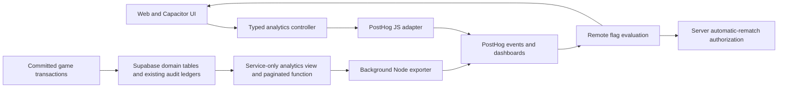

# Analytics architecture decisions and dashboard handoff

Recorded 2026-09-28. This is the engineering handoff for agents returning to analytics or building a PickleBash-owned dashboard. Current implementation details and the complete event catalog live in [ANALYTICS.md](ANALYTICS.md); rollout rules live in [FEATURE-FLAGS.md](FEATURE-FLAGS.md). Future options below are recommendations, not implemented features or a commitment to a provider.

## State at handoff

- Implemented: typed client events, PostHog adapters, stable account identity, committed database fact projection, background exporter, six flags, privacy controls, and four PostHog dashboards.
- Production setup: analytics SQL definition applied; 221 real backend events commissioned and verified; rematch flag targets only `dzuy`; other flags follow the flag guide. No synthetic events were sent.
- Release follow-up on 2026-09-28: `541904c` was pushed to `main`; Railway deployment `3358e09f-405d-4501-bfbd-1f4095b7e494` reached Active. All 12 settings and the rematch-intent migration were applied. Production health and analytics-enabled browser assets were verified. Remaining: iOS rebuild/device checks and full two-account gameplay/replay smoke checks.
- Verification at this snapshot: 771 tests passed and production build passed. Evidence: [verification.json](../artifacts/analytics/verification.json), [dashboard query snapshots](../artifacts/analytics/insight-queries.json), and screenshots in `artifacts/analytics/`.
- No custom dashboard, dashboard API, analytics warehouse, billing integration, or experiment statistics engine has been built.

Before resuming, inspect the current checkout, migrations, deployed revision, environment, and live dashboard definitions. Do not blindly replay the already-applied migration or assume staged settings are still pending. The checkout contained pre-existing rematch work required by the flag integration; it was reviewed and included in the authorized release. Screenshots remain local evidence; the query and verification JSON files are committed.

## Data flow and boundaries

PostHog is the current destination for behavioral analytics, retention queries, replay, and remote flag configuration. Supabase remains the source of truth for gameplay, committed rewards, invitations, and trusted entitlements. Analytics failure must not prevent gameplay. Flags do not grant entitlements, change Premium classification, or define billing policy.

## Decisions and reasons

| Decision | Reason and consequence |
| --- | --- |
| Keep a typed, provider-neutral application interface | UI code expresses product events without depending on SDK details. A future destination can replace the adapters; replacement still needs identity, delivery, and privacy work. |
| Share the web adapter with Capacitor | iOS uses the same WebView application, not a separate React Native tracking implementation. Native lifecycle/replay behavior still requires device verification. |
| Use persistent Supabase UUIDs, including guests | Guest upgrade preserves identity; email/name changes do not split users. PostHog SQL counts merged `person_id`; another system must explicitly preserve equivalent account grouping. |
| Give each fact one authoritative owner | Multiplayer success, XP, and trusted entitlement changes come from committed records, not button clicks. A client duplicate would inflate results. Solo/local limitations remain explicit. |
| Reuse domain records and existing audit ledgers | Avoid maintaining a second event database or queue before there is a demonstrated need. The view is a projection, not an immutable warehouse; retention, deletions, and source changes can affect future reconstruction. |
| Deliver outside game requests with stable receipts | Retries, overlap, and reconciliation recover committed facts without delaying play. Provider duplicate compaction is eventual; this is not a universal exactly-once guarantee. |
| Retain original domain timestamps | Ingestion can adjust timestamps. Ordered lifecycle analysis must use committed time where available rather than treating arrival order as game order. |
| Keep client telemetry best effort | UI exposures and app opens cannot always be recovered after blockers/offline operation. Absence is not proof that the player never saw a screen. |
| Disable broad automatic collection | Explicit events and scalar allowlists limit accidental secrets/free-text collection and event volume. Replay is sampled and heavily masked; canvas gameplay is not recorded. |
| Use managed dashboards first | Establish meaningful measures before building presentation infrastructure. A future custom dashboard should reuse definitions rather than invent new counts. |

## Where to change things

| Location | Responsibility |
| --- | --- |
| `src/analytics/events.ts` | Event/property types, required properties, flag names/defaults |
| `src/analytics/privacy.ts` | Runtime property allowlist and stripping |
| `src/analytics/core.ts` | Provider-neutral controller, identity transitions, queue, client receipts |
| `src/analytics/index.ts` | JS SDK, environment guards, replay privacy, flag freshness/fallbacks |
| `src/auth-session.ts` | Auth binding before routes and initial identity resolution |
| `server/multiplayer/analytics.ts` | Node SDK, flag evaluation, stable UUIDs, exporter and shutdown |
| `server/multiplayer/routes.ts` | Exporter startup and server rematch flag enforcement |
| `supabase/migrations/202609280003_product_analytics.sql` | Audit triggers, `product_analytics_events` view, service-only `product_analytics_page` function |
| `scripts/sync-product-analytics.ts` | Bounded commissioning/recovery; dry-run unless explicitly sending |
| `tests/analytics.test.ts` | Identity, privacy, fallback, delivery/retry behavior |
| `tests/analytics-database.test.ts` | Real database facts, stable origin, pagination and access boundaries |
| `.env.example` | Configuration names/defaults; no management API secret belongs in browser config |

The server row contract is `{event_id, actor_id, event, occurred_at, properties}`. The exporter maps `actor_id` to PostHog identity and derives a deterministic event UUID from environment, event name, and domain receipt. Pagination uses `(occurred_at, event_id)`; preserve original timestamp precision in cursor values. Do not replace this with offset pagination or a timestamp-only cursor.

## Metric contract for any future dashboard

| Metric | Definition or constraint |
| --- | --- |
| Active players | Distinct merged people with `app_opened` **or** human `shot_selected`. Current WAU/MAU queries use calendar buckets, not rolling 7/30-day windows. |
| Match volume | Distinct `match_id`; backend events are per human participant, so raw event count is not match count. |
| Completion rate | Multiplayer started-match cohort with a subsequent completion for the same ID. Divide completed cohort matches by started cohort matches, not unrelated date-window totals. |
| Matches per active player | Completed match participations among the players active in the same day, divided by that day's active players. |
| Core game funnel | Registered account creation → first multiplayer start/completion → second multiplayer start/completion. Do not imply all guest play or solo history is represented. |
| Rematch funnel | Join by `original_match_id`; require each preceding stage in order. Missing stages remain NULL, never epoch/zero timestamps. Automatic/manual origin is immutable. |
| Invite funnel | Join across people by `invite_id`, not a single-person funnel. Shared-link opens attributed to the inviter are not invitee identity. Copy/share is not proof of delivery. |
| Same-pair follow-on | For each unordered human pair with `n` distinct completed matches in the observed 90-day window: `100 * sum(max(n-1, 0)) / sum(n)`. This is a match-level measure, not the fraction of pairs who played twice. |
| Retention | Declare cohort event, return event, timezone, period and maturity. D7/D30 needs enough elapsed time; absent pre-rollout facts are not zero retention. |

Always state environment, time range, timezone, bot inclusion, game mode, and data freshness. Current ordered invite/rematch queries prefer `domain_timestamp_ms`, with second-resolution fallback for the initial export. Zero and unavailable/incomplete data must be distinguishable. Recent cohorts are censored by observation time.

The [saved query JSON](../artifacts/analytics/insight-queries.json) contains the corrected SQL for seven insights: completion, participations per active player, rematch/invite pipelines, and DAU/WAU/MAU. It is a setup snapshot, not automatic synchronization or a complete export of all dashboard configuration. Native funnel/retention definitions and filters must be retrieved from PostHog when porting. Preserve a versioned metric definition whenever a formula changes.

## Future PickleBash-owned dashboard

### Recommended first step: our UI, PostHog-backed queries

Build an authenticated internal dashboard whose server reads approved aggregate metrics from PostHog. Reuse the four existing dashboard definitions and saved SQL rather than replacing instrumentation. Keep any query/management credential on the server with the narrowest available read access; the public ingestion token is not a dashboard query credential. Verify current PostHog API authentication, endpoints, limits, and query capabilities at implementation time.

Use an allowlisted server metric interface, bounded date ranges, explicit environment/timezone filters, caching, and visible freshness/error states. Do not expose arbitrary SQL, raw person records, Supabase service credentials, or a PostHog secret to the browser. Internal admin authorization is separate from Premium player access.

This is the lowest-scope route to a custom visual experience while preserving PostHog's identity and retention machinery. It retains a PostHog dependency and query/usage costs. There is no need to use PostHog's conversational assistant to render saved metrics.

### Alternative: our own reporting system

Start with committed backend facts, using the existing projection or a reporting replica, and add bounded aggregates outside gameplay requests. Avoid unbounded analytical scans against the production game database. A new persistent reporting store would need explicit retention, deletion, schema versioning, reconciliation, authorization, freshness, and operational ownership decisions.

The current Supabase projection does **not** contain all client events, PostHog identity merges, session recordings, or historical experiment exposure. Full behavioral parity requires an intentional export of available PostHog history and/or a new durable destination for future client events. Do not promise to reconstruct app opens, cosmetic views, prompt exposures, or replay from match tables. Audit triggers are fail-open, so even backend audit coverage is not an absolute no-loss guarantee.

During migration, compare both systems over the same environment, cohort, timezone, event cutoff, bot rules, and deduplication keys. Document any historical gaps before switching the dashboard. If PostHog is later removed entirely, replace remote flag delivery and defaults separately; an analytics dashboard does not replace flag control or replay.

### Suggested acceptance checks when this work resumes

1. Confirm release state and which event families actually contain production data.
2. Export/version the live insight definitions, parameters and filters; choose explicit timezone and calendar/rolling-window semantics.
3. Build a read-only internal overview first: activity, multiplayer starts/completions, rematches and invites.
4. Match PostHog totals over a fixed window and verify duplicates, missing stages, merged identities, bot filtering and incomplete cohorts using fixtures.
5. Verify admin authorization, credential isolation, bounded queries, cache freshness and provider failure states.
6. Decide on additional storage or dual delivery only when a concrete reporting requirement cannot be met by this approach.

## Costs and operational follow-up

Billing was inspected on 2026-09-28: 515/500 PostHog AI credits, 221/1,000,000 product analytics events, and zero reported replay/flag usage. The exhausted allowance was the conversational assistant used during dashboard setup, not event collection. These are dated account readings, not a forecast or current price guarantee; recheck billing before changing plans. No paid upgrade was made in this work.

Prefer direct saved queries and ordinary dashboard configuration for follow-up work. Track product usage after release and set explicit per-product spending limits if upgrading. Budget limits can stop collection/evaluation; preserve application fallbacks and monitor missing telemetry. Keep deployment state, metric changes, and later cost decisions updated in these documents so another agent does not have to reconstruct them from chat.

September 28 follow-up (released in `8af8c6b`): solo countdowns now restart automatically at expiry; client-owned request/start/completion events preserve their automatic origin. Multiplayer lifecycle remains server-owned; dashboard metric definitions are unchanged.

Release follow-up: `8af8c6b` reached Active on Railway on September 28, 2026. TestFlight 1.0 (7) uploaded with production analytics configuration; Apple processing completed; export compliance, tester assignment, and physical-device checks remain pending. This release does not change remote flag targeting, event ownership, privacy rules, or dashboard metric definitions. See [release record](TESTFLIGHT.md).

September 28 subsequent rollout: `rematch_auto_countdown` enabled for 100% of all users, including guests, at the user’s request. This supersedes the initial dzuy-only targeting recorded above. Event ownership, privacy, and metric definitions are unchanged; see [feature flags](FEATURE-FLAGS.md).

## Custom dashboard implementation follow-up

The recommended PostHog-backed UI now has a local implementation at `/admin/analytics`. This supersedes the earlier “no custom dashboard” snapshot, but does not establish live deployment or data verification. The user opted for a clear setup state until a read/query key is configured. [Admin analytics](ADMIN-ANALYTICS.md) records access controls, provider interface, caching, exact metric differences (period-wide participation, open-independent invitation path, shifted mature D7 cohort), and the required live reconciliation checks. No warehouse or duplicate collection system was introduced.

Dashboard connection follow-up (2026-09-28): the local dashboard now loads live PostHog aggregates. Its server-only query settings and owner allowlist are saved on Railway for the next deployment; the dashboard code has not been deployed. See [dashboard connection and validation record](ADMIN-ANALYTICS.md#connection-follow-up--2026-09-28).

Homepage routing follow-up (local, not deployed): the public `/` entry does not load game authentication or the analytics adapter; `src/game-bootstrap.ts` retains their existing ordering for game entry. Homepage visits do not count as active-player app opens. Event ownership, identity and metric definitions remain unchanged. See [homepage routing](HOMEPAGE.md).

### Billing implementation handoff (2026-09-29; local)

Permanent pack ownership now lives in server-owned billing tables; see [billing operations](BILLING.md). Purchase buttons and checkout redirects do not emit completed/restored payment facts. `plus_entitlement_changed` and `has_full_game_analysis` still describe the historical trusted analysis metadata, not cosmetic pack ownership. Existing metric/event ownership remains unchanged. The new complimentary administration form is excluded from capture; account identifiers and grant reasons must never be added to product events. A reviewed billing-event migration is still needed before using product analytics as a purchase ledger.

Purchase-sandbox follow-up (2026-09-29): the separate Railway service and TestFlight 1.0 (8) use only sandbox database facts, with client/server PostHog and replay explicitly disabled and no ingestion keys copied. Standard account audit hooks were restored after schema-only branching; their facts remain local to that database. Event ownership, privacy rules, metric definitions and production remote targeting are unchanged. See [purchase testing](PURCHASE-TESTING.md) for the dated deployment and physical-test status.

## Account-safety preparation — September 29, 2026

Account-safety changes prepared in the shared checkout: no dashboard, metric, flag, identity or event-owner changes. Recordings block account-safety dialogs. External deletion cleanup is manual; see ACCOUNT-SAFETY.md. Not deployed.

Owner admin follow-up (local, October 1, 2026): `/admin` provides account management for the verified dzuy UUID, independently of analytics access. Both `/admin` and `/admin/*` skip product identity binding, capture and replay. Per-account game counts are retained database records, not changed analytics metrics. Event ownership, privacy, identity and remote flag targeting are unchanged. Account removal now archives records and blocks access; existing analytics histories and metric definitions are retained. Owner-requested erasure remains a separate process. See [owner administration](ADMIN.md) for access, audit and release status.

Web beta entry follow-up (October 2, 2026): `/` remains public marketing without auth or product telemetry. Web game entry now resolves the existing auth client at the account gate before loading gameplay. Existing account-dialog onboarding events, identity binding, app-open behavior for game-entry routes, privacy rules, and metric definitions are retained; opening the gate is not evidence of successful registration or gameplay. Native entry and admin authorization remain unchanged. Beta access uses registered-session state, not a feature flag or Premium entitlement. No new marketing events, flag targeting, or production configuration changes were made. See [homepage beta access](HOMEPAGE.md#web-beta-access--october-2-2026).

Owner To-do List follow-up (local, October 3, 2026): `/admin/todos` uses the existing `/admin/*` exclusion from product identity binding, capture and replay. Task content stays in service-only storage behind immutable-owner authorization. No analytics events, metric definitions, entitlements, feature flags or remote targeting changed. The private table and its least-privilege correction were installed with explicit approval on October 3; web release `d9714af` is active. See [owner administration](ADMIN.md#private-to-do-list--local-implementation-october-3-2026).
